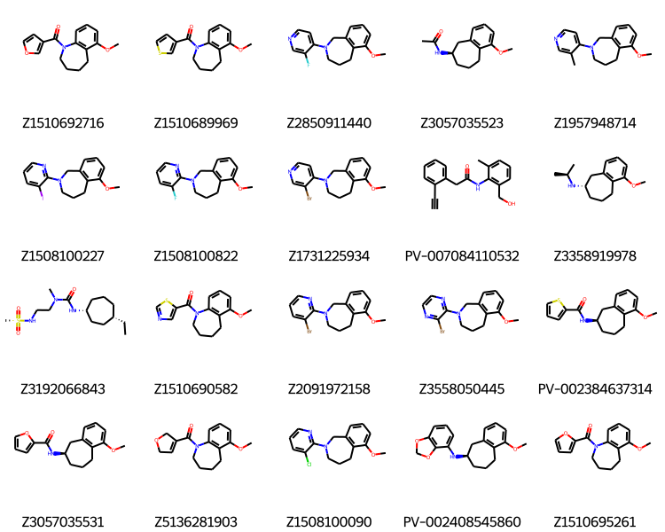

# PHIP-Fragmenstein
Fragmenstein pipeline applied to PHIP FBDD screen

## Background

The SAMPL challenge is described in https://link.springer.com/article/10.1007/s10822-022-00452-7

The PDB deposition group is `G_1002162`.

## Data

| Filename | Date modified | Molecules | Median MW | Description                                                          |
| -------- | -------- | -------- | -------- |----------------------------------------------------------------------|
| [hits.sdf](data/hits.sdf) | 2022-06-29 13:13:24.913366  | 56 | 204 | The template aligned hits from the deposition group                  |
| [combinations.sdf](data/combinations.sdf) | 2022-05-27 15:01:13.469336  | 3074 | 219 | All the pairwise combinations from Fragmenstein (inc. janky ones)    |
| [placements.sdf](data/placements.sdf) | 2022-05-27 15:02:24.461896  | 90 | 227 | Placed analogues from SmallWorld of the combintions (ref. data lost) |
| [LE_best_combinations.sdf](data/LE_best_combinations.sdf) | 2022-05-27 15:01:36.528786  | 10 | 227 | Only the top 10 from the above                                       |
| [LE_best_placements.sdf](data/LE_best_placements.sdf) | 2022-05-27 15:02:11.618702  | 10 | 232 | Only the top 10 from the above                                       |
| [F584_placements.sdf](data/F584_placements.sdf) | 2022-05-27 16:42:20.575919  | 335 | 297 | All the placements from the above which include F584                 |
| [F584_best_placements.sdf](data/F584_best_placements.sdf) | 2022-05-27 16:42:37.344729  | 20 | 286 | Top 20 of the above                                                  |
| [F584-F616_placements.sdf](data/F584-F616_placements.sdf) | 2022-06-10 12:06:51.286664  | 8 | 289 | Placements of analogues of the combination of the two named hits |
| [F584-F687_placements.sdf](data/F584-F687_placements.sdf) | 2022-06-10 12:06:52.844204  | 10 | 289 | Placements of analogues of the combination of the two named hits |
| [F558-F584_placements.sdf](data/F558-F584_placements.sdf) | 2022-06-10 12:06:55.405324  | 10 | 289 | Placements of analogues of the combination of the two named hits |
| [F584-F709_placements.sdf](data/F584-F709_placements.sdf) | 2022-06-10 12:06:58.062950  | 9 | 289 | Placements of analogues of the combination of the two named hits |
| [F199-F584_placements.sdf](data/F199-F584_placements.sdf) | 2022-06-10 12:07:00.267817  | 10 | 289 | Placements of analogues of the combination of the two named hits |
| [F217-F584_placements.sdf](data/F217-F584_placements.sdf) | 2022-06-10 12:07:02.777390  | 11 | 289 | Placements of analogues of the combination of the two named hits |
| [F368-F584_placements.sdf](data/F368-F584_placements.sdf) | 2022-06-10 12:07:06.815200  | 17 | 289 | Placements of analogues of the combination of the two named hits |
| [F170-F584_placements.sdf](data/F170-F584_placements.sdf) | 2022-06-10 12:07:08.724130  | 9 | 289 | Placements of analogues of the combination of the two named hits |
| [F126-F584_placements.sdf](data/F126-F584_placements.sdf) | 2022-06-10 12:07:11.706223  | 10 | 289 | Placements of analogues of the combination of the two named hits |
| [triple_F584_combinations.sdf](data/triple_F584_combinations.sdf) | 2022-06-10 12:33:06.907028  | 1115 | 357 | Three way combinations of F584 an another two hits |

## Results

Two notebooks are presented here:

* dataset_polishing — data gathering and preprocessing
* fragmenstein - the actual pipeline

The latter was run with the default settings, namely:

* pairwise
* Top 10 combinations, searched for purchasables and placed
* LE filtering
* `percent_hybrid` left at 30% (i.e. in 10 atom merger, the 7 or fewer atoms come from the primary hit,while 3 or more atoms come from the secondary hit)
* standard RMSD < 1. &Aring;
* 'Quick reanimation' (stops trying to minimise hard cases as they would be discarded anyway)

These are the top 10 placements:

| name            | smiles                             | merger_inspiration_names   | mode      |   ∆∆G |   merger_∆∆G |   comRMSD |   N_constrained_atoms |   N_unconstrained_atoms |   runtime |   LE |   merger_∆∆G |
|:----------------|:-----------------------------------|:---------------------------|:----------|------:|-------------:|----------:|----------------------:|------------------------:|----------:|-----:|-------------:|
| Z1741815525     | CC1=CC=CC2=C1CCCN2CCN              | ['F195', 'F11A']           | expansion |  -8.8 |         -9.1 |       0.5 |                    14 |                       0 |      36   | -0.6 |         -9.1 |
| PV-004837860770 | C=CCN1CCC2=CC(C)=CC=C21            | ['F366', 'F170']           | expansion |  -7.5 |         -8.9 |       0.5 |                    13 |                       0 |      28.6 | -0.6 |         -8.9 |
| Z4151362389     | CC(C)(C)C1=CN(CC2=CN=CO2)C(=O)C=C1 | ['F96', 'F275A']           | expansion |  -9.8 |        -10.5 |       0.4 |                    17 |                       0 |      33.5 | -0.6 |        -10.5 |
| PV-006133632842 | C#CCCN1CCC2=CC=CC=C21              | ['F14', 'F170']            | expansion |  -7.4 |         -7.8 |       0.3 |                    13 |                       0 |      27.8 | -0.6 |         -7.8 |
| PV-005319971059 | C=CCN1CCCC2=C1C=CC=C2Br            | ['F195', 'F11A']           | expansion |  -7.8 |         -9.1 |       0.6 |                    14 |                       0 |      35.2 | -0.6 |         -9.1 |
| Z2832701125     | CC(C)(C)C1=CN(CC2=CC=CS2)C(=O)C=C1 | ['F96', 'F275A']           | expansion | -10.4 |        -10.5 |       0.9 |                    13 |                       6 |      50.7 | -0.5 |        -10.5 |
| PV-002119214916 | CC1=CC=CC2=C1CCCN2CCF              | ['F195', 'F11A']           | expansion |  -7.6 |         -9.1 |       0.5 |                    14 |                       0 |      35.6 | -0.5 |         -9.1 |
| Z2613920890     | CC(C)(C)C1=CN(CC2=CN=CS2)C(=O)C=C1 | ['F96', 'F275A']           | expansion |  -9.2 |        -10.5 |       0.4 |                    17 |                       0 |      32.8 | -0.5 |        -10.5 |
| PV-003850534502 | CC(C)(C)C1=CC=C(O)C(C=C2CCOC2)=C1  | ['F96', 'F275A']           | expansion |  -9.1 |        -10.5 |       0.8 |                    17 |                       0 |      35.1 | -0.5 |        -10.5 |
| Z883547008      | C=CCN1CCC2=CC(Br)=CC=C21           | ['F366', 'F170']           | expansion |  -6.9 |         -8.9 |       0.5 |                    13 |                       0 |      30.1 | -0.5 |         -8.9 |

The top mergers involving F584 sorted by ∆∆G and not ligand efficiency (thus biasing the sort by size of the ligand),
gives these top mergers

The top purchasable similars (sorted by LE):

| name            | smiles                                  | merger_inspiration_names   | mode      |   ∆∆G |   merger_∆∆G |   comRMSD |   N_constrained_atoms |   N_unconstrained_atoms |   runtime |   LE |   merger_∆∆G |
|:----------------|:----------------------------------------|:---------------------------|:----------|------:|-------------:|----------:|----------------------:|------------------------:|----------:|-----:|-------------:|
| Z1510692716     | COC1=CC=CC2=C1CCCCN2C(=O)C3=COC=C3      | ['F584', 'F650']           | expansion | -12.7 |         -9.6 |       0.7 |                    23 |                       0 |      82.1 | -0.6 |         -9.6 |
| Z1510689969     | COC1=CC=CC2=C1CCCCN2C(=O)C3=CSC=C3      | ['F584', 'F650']           | expansion | -12   |         -9.6 |       0.6 |                    23 |                       0 |      78.3 | -0.5 |         -9.6 |
| Z2850911440     | COC1=CC=CC2=C1CCCN(C3=CC=NC=C3F)C2      | ['F584', 'F687']           | expansion | -11   |         -9.4 |       0.7 |                    22 |                       0 |      92.7 | -0.5 |         -9.4 |
| Z3057035523     | COC1=CC=CC2=C1CCCC(NC(C)=O)C2           | ['F584', 'F96']            | expansion |  -9.5 |         -9.4 |       0.5 |                    19 |                       0 |      73.8 | -0.5 |         -9.4 |
| Z1957948714     | COC1=CC=CC2=C1CCCN(C3=CC=NC=C3C)C2      | ['F584', 'F687']           | expansion | -10.9 |         -9.4 |       0.8 |                    22 |                       0 |      89.7 | -0.5 |         -9.4 |
| Z1508100227     | COC1=CC=CC2=C1CCCN(C3=NC=CC=C3I)C2      | ['F584', 'F687']           | expansion | -10.8 |         -9.4 |       0.7 |                    22 |                       0 |      76.1 | -0.5 |         -9.4 |
| Z1508100822     | COC1=CC=CC2=C1CCCN(C3=NC=CC=C3F)C2      | ['F584', 'F687']           | expansion | -10.3 |         -9.4 |       0.8 |                    22 |                       0 |      67.1 | -0.5 |         -9.4 |
| Z1731225934     | COC1=CC=CC2=C1CCCN(C3=CC=NC=C3Br)C2     | ['F584', 'F687']           | expansion | -10.3 |         -9.4 |       0.8 |                    22 |                       0 |      87.3 | -0.5 |         -9.4 |
| PV-007084110532 | C#CC1=CC=CC=C1CC(=O)NC2=C(CO)C=CC=C2C   | ['F529', 'F584']           | expansion | -10.7 |         -8.2 |       0.8 |                    22 |                       1 |      87.9 | -0.5 |         -8.2 |
| Z3358919978     | COC1=CC=CC2=C1CCCC(NC(C)C)C2            | ['F584', 'F96']            | expansion |  -9.7 |         -9.4 |       0.8 |                    20 |                       1 |      82.6 | -0.5 |         -9.4 |
| Z3192066843     | CCC1CCCC(NC(=O)N(C)CCNS(C)(=O)=O)CC1    | ['F616', 'F584']           | expansion | -10.4 |        -10.9 |       0.9 |                    22 |                       1 |     122.3 | -0.5 |        -10.9 |
| Z1510690582     | COC1=CC=CC2=C1CCCCN2C(=O)C3=CN=CS3      | ['F584', 'F650']           | expansion | -10.7 |         -9.6 |       0.8 |                    22 |                       2 |      84.7 | -0.4 |         -9.6 |
| Z2091972158     | COC1=CC=CC2=C1CCCN(C3=NC=CC=C3Br)C2     | ['F584', 'F687']           | expansion |  -9.7 |         -9.4 |       0.7 |                    22 |                       0 |      88.9 | -0.4 |         -9.4 |
| Z3558050445     | COC1=CC=CC2=C1CCCN(C3=NC=CN=C3Br)C2     | ['F584', 'F687']           | expansion |  -9.7 |         -9.4 |       0.7 |                    22 |                       0 |      87.3 | -0.4 |         -9.4 |
| PV-002384637314 | COC1=CC=CC2=C1CCCC(NC(=O)C3=CC=CS3)C2   | ['F584', 'F374']           | expansion | -10   |         -8.3 |       0.5 |                    21 |                       2 |      86.1 | -0.4 |         -8.3 |
| Z3057035531     | COC1=CC=CC2=C1CCCC(NC(=O)C3=CC=CO3)C2   | ['F584', 'F374']           | expansion |  -9.8 |         -8.3 |       0.8 |                    21 |                       2 |      81.3 | -0.4 |         -8.3 |
| Z5136281903     | COC1=CC=CC2=C1CCCCN2C(=O)C3=CCOC3       | ['F584', 'F650']           | expansion | -10   |         -9.6 |       1   |                    22 |                       2 |      77.1 | -0.4 |         -9.6 |
| Z1508100090     | COC1=CC=CC2=C1CCCN(C3=NC=CC=C3Cl)C2     | ['F584', 'F687']           | expansion |  -9.2 |         -9.4 |       0.8 |                    22 |                       0 |      78.2 | -0.4 |         -9.4 |
| PV-002408545860 | COC1=CC=CC2=C1CCCC(NC3=CC=CC4=C3OCO4)C2 | ['F584', 'F740']           | expansion | -10.4 |        -11   |       0.8 |                    25 |                       0 |      79   | -0.4 |        -11   |
| Z1510695261     | COC1=CC=CC2=C1CCCCN2C(=O)C3=CC=CO3      | ['F584', 'F650']           | expansion |  -9.9 |         -9.6 |       0.9 |                    23 |                       1 |      77.3 | -0.4 |         -9.6 |

The top hit looks nice:

Most of the purchaseable are kinked-favonoid–look-alikes (I have not tried a flavonoid as the angles would not work,
as the middle ring is a 7-membered lactam not a pyrone).

Two differ from this:

Z3192066843 has a sticky-out sulfamine and PV-002408545860 has a benzofuzan-like ring as the extra.